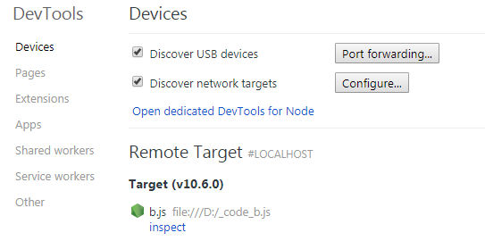

# [错误处理/调试](/sections/error.md)

* [`[Doc]` Errors (异常)](/sections/error.md#errors)
* [`[Doc]` Domain (域)](/sections/error.md#domain)
* [`[Doc]` Debugger (调试器)](/sections/error.md#debugger)
* [`[Doc]` C/C++ 插件](/sections/error.md#cc-插件)
* [`[Doc]` V8](/sections/error.md#v8)
* [`[Point]` 内存快照](/sections/error.md#内存快照)
* [`[Point]` CPU profiling](/sections/error.md#cpu-profiling)

## errors

Node.js 应用程序一般会遇到以下四类错误：

 - 标准的 JavaScript 错误，例如 <EvalError>、<SyntaxError>、<RangeError>、<ReferenceError>、<TypeError> 或 <URIError>。
 - 由底层操作系触发的系统错误，例如试图打开不存在的文件、或试图使用已关闭的 socket 发送数据。
 - 由应用程序代码触发的用户自定义的错误。
 - `AssertionError` 错误，当 Node.js 检测到不应该发生的异常逻辑时触发。这类错误通常来自 assert 模块。

标准的 JavaScript 错误：

 — EvalError： 创建一个error实例，表示错误的原因：与 eval() 有关。
 — RangeError： 创建一个error实例，表示错误的原因：数值变量或参数超出其有效范围。
 — ReferenceError： 创建一个error实例，表示错误的原因：无效引用。
 — SyntaxError： 创建一个error实例，表示错误的原因：eval()在解析代码的过程中发生的语法错误。
 — TypeError： 创建一个error实例，表示错误的原因：变量或参数不属于有效类型。
 — URIError： 创建一个error实例，表示错误的原因：给 encodeURI()或  decodeURl()传递的参数无效。
 — InternalError： 
创建一个代表Javascript引擎内部错误的异常抛出的实例。 如: "递归太多"。

> InternalError是非标准的，请尽量不要在生产环境中使用它！

> 参考：https://developer.mozilla.org/zh-CN/docs/Web/JavaScript/Reference/Global_Objects/Error

> 更多Error异常的属性和方法：http://nodejs.cn/api/errors.html#errors_errors

## domain

官方即将废弃这个模块。

## debugger

使用 `--inspect` 参数启动 Node.js 可开启调试模式。不建议在终端调试，可配合Chrome浏览器调试代码。

输入 `chrome://inspect` 或者`about:inspect`，界面如下：

点击`inspect`进入调试模式。

> 详细用法参考： 
> 1.http://www.ruanyifeng.com/blog/2018/03/node-debugger.html 
> 2.https://nodejs.org/zh-cn/docs/guides/debugging-getting-started/

## C/C++ 插件

C/C++插件开发超过本人知识范围，文档可查看：http://nodejs.cn/api/addons.html

## v8

Node是基于Chrome V8引擎开发的能使JavaScript在服务器端运行的运行时环境。

> `v8`模块可以查看系统相关信息，http://nodejs.cn/api/v8.html。

## 内存快照

开启调试模式，在Chrome中Memory中查看详细信息。

> 关于DevTools 内存信息的使用可查看：https://developers.google.com/web/tools/chrome-devtools/memory-problems/

## cpu profiling

开启调试模式，在Chrome中Profiler中查看详细信息。

> 关于DevTools 分析器的使用可查看：https://developers.google.com/web/tools/chrome-devtools/memory-problems/allocation-profiler
