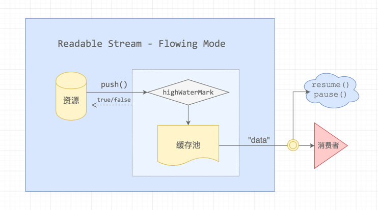
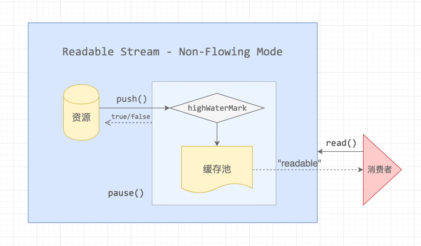
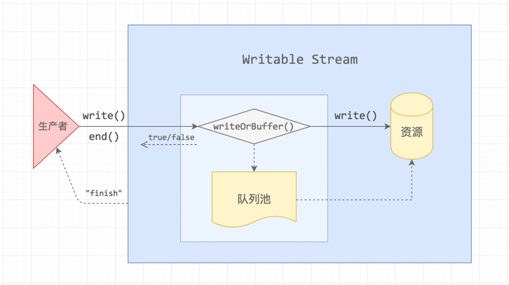

# [IO](/sections/io.md)

* [`[Doc]` Buffer](/sections/io.md#buffer)
* [`[Doc]` String Decoder (字符串解码)](/sections/io.md#string-decoder)
* [`[Doc]` Stream (流)](/sections/io.md#stream)
* [`[Doc]` Console (控制台)](/sections/io.md#console)
* [`[Doc]` File System (文件系统)](/sections/io.md#file)
* [`[Doc]` Readline](/sections/io.md#readline)
* [`[Doc]` REPL](/sections/io.md#repl)

## Buffer

`Buffer`是node的核心模块，用来处理二进制数据。`Buffer`的大小在创建时确定，且无法改变。

基础示例：
```js
// 创建一个长度为 10、且用 0 填充的 Buffer。
const buf1 = Buffer.alloc(10);

// 创建一个长度为 10、且用 0x1 填充的 Buffer。 
const buf2 = Buffer.alloc(10, 1);

// 创建一个长度为 10、且未初始化的 Buffer。
// 这个方法比调用 Buffer.alloc() 更快，但返回的 Buffer 实例可能包含旧数据，因此需要使用 fill() 或 write() 重写。
const buf3 = Buffer.allocUnsafe(10);

// 创建一个包含 [0x1, 0x2, 0x3] 的 Buffer。
const buf4 = Buffer.from([1, 2, 3]);

// 创建一个包含 UTF-8 字节 [0x74, 0xc3, 0xa9, 0x73, 0x74] 的 Buffer。
const buf5 = Buffer.from('tést');

// 创建一个包含 Latin-1 字节 [0x74, 0xe9, 0x73, 0x74] 的 Buffer。
const buf6 = Buffer.from('tést', 'latin1');
```

> 官方文档：http://nodejs.cn/api/buffer.html#buffer_new_buffer_array

## String Decoder

### 字符编码

计算机内部的信息都是用`0`和`1`的二进制格式保存，每一个二进制位称为`1bit`，八个二进制位等于一个字节(`1byte`)。

ASCII 码一共规定了128个字符的编码，比如空格`SPACE`是32（二进制00100000），大写的字母`A`是65（二进制01000001）。这128个符号（包括32个不能打印出来的控制符号），只占用了一个字节的后面7位，最前面的一位统一规定为0。

ASCII是一种字符集，另外还有Unicode、GBK，**字符集**是一系列字符、标点符号的集合。
**字符编码**描述的是字符对应的二进制或其他进制的数字编码。

Node.js 支持的字符编码有：

 - 'ascii' - 仅支持 7 位 ASCII 数据。

 - 'utf8' - 多字节编码的 Unicode 字符。

 - 'utf16le' - 2 或 4 个字节，小端序编码的 Unicode 字符。支持代理对（U+10000 至 U+10FFFF）。

 - 'ucs2' - 'utf16le' 的别名。

 - 'base64' - Base64 编码。

 - 'latin1' - 将 Buffer 编码成单字节编码的字符串。

 - 'binary' - 'latin1' 的别名。

 - 'hex' - 将每个字节编码成两个十六进制字符。

> 来源：http://nodejs.cn/api/buffer.html#buffer_buffers_and_character_encodings

```js
const str1 = Buffer.from('abc123');
const str2 = Buffer.from('abc123','base64');
const str3 = Buffer.from('abc123','hex');
const str4 = Buffer.from('abc123','ascii');
console.log(str1); // <Buffer 61 62 63 31 32 33>
console.log(str2); // <Buffer 69 b7 35 db>
console.log(str3); // <Buffer ab c1 23>
console.log(str4); // <Buffer 61 62 63 31 32 33>
```
> 一个字符可能有多种字符编码方式，对应的结果可能不同。

> node是不支持gbk、gb2312编码的，如果编码为它们会报错`Unknown encoding: xx`。可以通过第三方模块[iconv-lite](https://www.npmjs.com/package/iconv-lite)来转换编码。

我们分别看三个从一个字节到三个字节的UTF-8编码例子：

实际字符	| 在Unicode字库序号的十六进制	| 在Unicode字库序号的二进制 |	UTF-8编码后的二进制	| UTF-8编码后的十六进制
--------|---------|----------|-----------|---------
$	| 0024 |	010 0100 |	0010 0100	| 24
严	| 4E25 |	1001 1100 0100 101	|	11100100 10111000 10100101	| E4 B8 A5
€	| 20AC |	0010 0000 1010 1100 |	1110 0010 1000 0010 1010 1100	| E2 82 AC

> Unicode 与 UTF-8 之间的转换方式：http://www.ruanyifeng.com/blog/2007/10/ascii_unicode_and_utf-8.html

### string_decoder 模块

`string_decoder`模块用于将`Buffer`转成对应的字符串。

调用`stringDecoder.write(buffer)`可以获取buffer对应的字符串。如果buffer结尾存在不完整字节，内部会缓存不完整的数据，直到再次传入剩余字节来拼接完整的字符。

```js
const StringDecoder = require('string_decoder').StringDecoder;
const decoder = new StringDecoder('utf8');

const str = decoder.write(Buffer.from([0xe4, 0xbd, 0xa0]));
console.log(str);  // 你
```

```js
// Buffer.from('你好') => <Buffer e4 bd a0 e5 a5 bd>
let str = decoder.write(Buffer.from([0xe4, 0xbd, 0xa0, 0xe5, 0xa5]));
console.log(str);  // 你

str = decoder.end(Buffer.from([0xbd]));
console.log(str);  // 好
```

> 当`decoder.end([buffer])`被调用时，内部剩余的buffer会被一次性返回。如果最后存在不完整字节，就会在结尾返回`�`。

> 参考：https://segmentfault.com/a/1190000009536199

## stream

### Readable Stream

`Readable Stream`存在两种模式：

```
1、流动模式：可读流自动读取数据，通过EventEmitter接口的事件尽快将数据提供给应用。

2、暂停模式：必须显式调用stream.read()方法来从流中读取数据片段。
```

#### 流动模式


```js
const readable = getReadableStreamSomehow();
readable.on('data', (chunk) => {
  console.log(`接收到 ${chunk.length} 个字节的数据`);
});
```

数据会先push到缓存池，数据超过`highWaterMark `指定的阈值时，流会暂时停止从底层资源读取数据，直到当前缓冲的数据被消费。

#### 暂停模式



```js
const myReadable = new MyReadable(dataSource);
myReadable.setEncoding('utf8');
myReadable.on('readable', () => {});
```
监听 `readable` 的回调函数第一个参数不会传递内容，需要我们通过 `myReadable.read()` 主动读取内容。

> http://taobaofed.org/blog/2017/08/31/nodejs-stream/

### Writable Stream

原理与Readable Stream类似，数据流会直接写入资源池，当写入速度比较缓慢或者暂停，数据会进入队列池缓存起来。
如果连队列池也满了（超过了highWaterMark选项的数值），生产者停止生产。
当队列释放之后，Writable Stream 会给生产者发送一个 drain 消息，让它恢复生产。



> http://nodejs.cn/api/stream.html#stream_class_stream_writable

## console

`console`模块是全局对象，可以直接使用。它是否同步，取决于哪种流以及操作系统。

全局的 `console` 是一个特殊的 `Console`类。其输出发送到 `process.stdout` 和 `process.stderr`，相当于：

```js
new Console({ stdout: process.stdout, stderr: process.stderr });
```

`Console` 类可用于创建具有可配置的输出流的简单记录器。

```js
const output = fs.createWriteStream('./stdout.log');
const errorOutput = fs.createWriteStream('./stderr.log');
// 自定义的简单记录器。
const logger = new Console({ stdout: output, stderr: errorOutput });
// 像控制台一样使用它。
const count = 5;
logger.log('count: %d', count);
// 在 stdout.log 中: count 5
```

> 其他的具体方法可以查看文档：http://nodejs.cn/api/console.html

## file

在Node中，所有与文件增删改查有关的操作都通过`fs`模块实现。

### 权限位 mode

使用 GIt 或 Linux 命令`ls -al`，可查看中文件和文件夹的权限位。
```
drwxr-xr-x 1 OP.100100 1049089      0 四月  3 09:11 .git/
-rw-r--r-- 1 OP.100100 1049089    292 四月  2 11:04 .gitignore
```
`d`开头代表文件夹，`-`开头，按每三位划分一个角色，分别代表读（r）、写（w）和执行（x），- 代表没有当前位对应的权限。

分别是三种角色：文件所有者(自己，owner)，文件所属组(家人，group)，其他用户(陌生人，others)。

当权限为[-rwxrwx—]时，分数则是：

```
owner = rwx = 4 + 2 + 1 = 7
group = rwx = 4 + 2 + 1 = 7
others = — = 0 + 0 + 0 = 0
```
所以该文件的权限数字就是770。