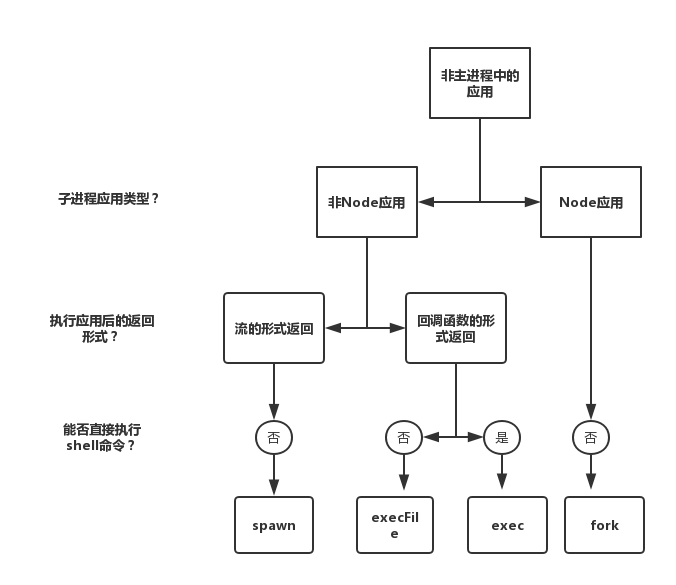

# [进程](/sections/process.md)

* [`[Doc]` Process (进程)](/sections/process.md#process)
* [`[Doc]` Child Processes (子进程)](/sections/process.md#child-process)
* [`[Doc]` Cluster (集群)](/sections/process.md#cluster)
* [`[Basic]` 进程间通信](/sections/process.md#进程间通信)
* [`[Basic]` 守护进程](/sections/process.md#守护进程)

## process

`process` 对象是一个全局变量，提供 Node.js 进程的有关信息以及控制进程。
官方文档：http://nodejs.cn/api/process.html

### 操作系统中的进程与线程

对于操作系统来说，一个任务就是一个`进程（Process）`，比如打开一个浏览器就是启动一个浏览器进程，打开一个记事本就启动了一个记事本进程，打开两个记事本就启动了两个记事本进程，打开一个Word就启动了一个Word进程。

有些进程还不止同时干一件事，比如Word，它可以同时进行打字、拼写检查、打印等事情。在一个进程内部，要同时干多件事，就需要同时运行多个“子任务”，我们把进程内的这些“子任务”称为`线程（Thread）`。

> 参考：[进程和线程](https://www.liaoxuefeng.com/wiki/0014316089557264a6b348958f449949df42a6d3a2e542c000/0014319272686365ec7ceaeca33428c914edf8f70cca383000)

## child-process

`child_process` 模块提供了衍生子进程的功能，可以充分利用CPU资源。

创建子进程的方式：

 - child_process.spawn(command[, args][, options])
 - child_process.exec(command[, options][, callback])
 - child_process.execFile(file[, args][, options][, callback])
 - child_process.fork(modulePath[, args][, options])

> `exec()`、`execFile()`、`fork()`底层都是通过`spawn()`实现的。


四者区别：



### spawn

子进程中执行的是非node程序，提供一组参数后，执行的结果以流的形式返回。

```js
const { spawn } = require('child_process');
const ls = spawn('ls', ['-lh', '/usr']);

ls.stdout.on('data', (data) => {
  console.log(`stdout: ${data}`);
});

ls.stderr.on('data', (data) => {
  console.log(`stderr: ${data}`);
});

ls.on('close', (code) => {
  console.log(`子进程退出码：${code}`);
});
```

### exec

衍生一个 shell， 并在 shell 中执行 `command`（非node程序），并缓冲产生的输出。 `command` 会被 shell 直接执行，特殊字符要进行相应处理。

```js
var exec = require('child_process').exec;

// 成功的例子
exec('ls -al', function(error, stdout, stderr){
    if(error) {
        console.error('error: ' + error);
        return;
    }
    console.log('stdout: ' + stdout);
});
```

> 当成功时，`error` 会是 `null`。 当出错时，`error` 会是 `Error` 实例。`error.code` 属性是子进程的退出码，`error.signal` 是终止进程的信号。

### execFile

与 child_process.exec() 类似，除了默认不衍生 shell。 可执行的 file 会被直接衍生为一个新进程，这使得它比 child_process.exec() 更高效。

```js
const { execFile } = require('child_process');
const child = execFile('node', ['--version'], (error, stdout, stderr) => {
  if (error) {
    throw error;
  }
  console.log(stdout);
});
```

### fork

子进程执行的是node程序，提供一组参数后，执行的结果以流的形式返回，与`spawn`不同，`fork`生成的子进程只能执行node应用。

```js
// child.js
process.on('message',function(msg){
   process.send(msg)
})

// parent.js
let cp=require('child_process');
let child=cp.fork('./child');
child.on('message',function(msg){
  console.log('got a message is',msg);
});
child.send('hello world');
```

> 参考：<br/>
> 1.https://segmentfault.com/a/1190000016169207#articleHeader5 <br/>
> 2.https://segmentfault.com/a/1190000007735211?utm_source=tag-newest#articleHeader6 <br/>
> 3.http://nodejs.cn/api/child_process.html#child_process_subprocess_send_message_sendhandle_options_callback <br/>

## cluster

`cluster`意为集成，`cluster`模块可以充分利用多核系统，创建多个子进程。`cluster`，模块是对`child_process.fork`方法的进一步封装，在实现创建子进程的功能上，还实现了自动的**负载均衡**功能。

基本使用方法：http://nodejs.cn/api/cluster.html

## 进程间通信